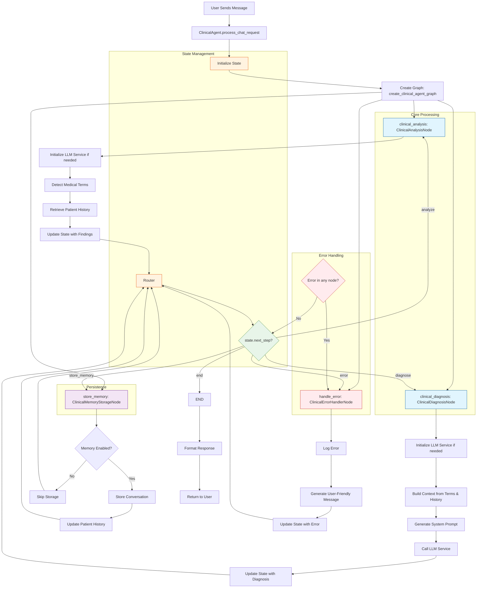

# Clinical Agent (Spanish-Speaking)

A sophisticated LangGraph-based clinical agent that provides direct diagnosis and treatment recommendations in Spanish. This agent is designed to process medical queries, analyze symptoms, and provide clinical guidance based on patient history and medical context.

## Detailed Flow Diagram



## Detailed Flow Explanation

### 1. Initialization Phase
- **Entry Point**: `ClinicalAgent.process_chat_request()` receives the user's message
- **State Initialization**: Creates initial state with:
  - Conversation details
  - Medical context
  - Empty detected terms and patient history
  - Metadata and metrics
- **Graph Creation**: Initializes the agent graph with all necessary nodes

### 2. Analysis Phase (ClinicalAnalysisNode)
- **LLM Initialization**: Sets up LLM service if not already done
- **Term Detection**: Uses regex patterns to identify medical terms in Spanish:
  - Symptoms (síntomas)
  - Conditions (condiciones)
  - Severity (gravedad)
  - Duration (duración)
- **History Retrieval**: Fetches relevant patient history if memory is enabled
- **State Update**: Updates state with findings and sets `next_step` to "diagnose"

### 3. Diagnosis Phase (ClinicalDiagnosisNode)
- **Context Building**: Creates context from detected terms and history
- **Prompt Generation**: Builds system prompt based on settings:
  - Includes symptoms and conditions
  - Considers severity and duration
  - Incorporates patient history
- **LLM Interaction**: Calls the LLM service to generate diagnosis
- **Response Formatting**: Structures the response with:
  - Clear diagnosis
  - Severity assessment
  - Recommended actions
  - Follow-up advice

### 4. Memory Storage (ClinicalMemoryStorageNode)
- **Memory Check**: Verifies if memory is enabled
- **Storage**: If enabled:
  - Stores conversation in memory
  - Updates patient history
- **State Update**: Sets `next_step` to "end"

### 5. Routing Logic
- **State-Based Routing**: Directs flow based on `state["next_step"]`
- **Possible Transitions**:
  - "analyze" → ClinicalAnalysisNode
  - "diagnose" → ClinicalDiagnosisNode
  - "store_memory" → ClinicalMemoryStorageNode
  - "error" → ClinicalErrorHandlerNode
  - "end" → Terminate

### 6. Error Handling
- **Error Detection**: Catches exceptions at each step
- **Error Processing**:
  - Logs detailed error information
  - Generates user-friendly error messages in Spanish
  - Ensures graceful degradation

### 7. Response Generation
- **Final Formatting**: Prepares the response with:
  - Diagnosis and recommendations
  - Any relevant context
  - Metadata and metrics
- **User Feedback**: Returns the formatted response to the user

## Key Scenarios

### Normal Flow
1. User describes symptoms in Spanish
2. System analyzes, diagnoses, and responds
3. Conversation is stored in memory

### Missing Information
1. User provides incomplete information
2. System may request additional details
3. Flow continues once information is complete

### Emergency Situation
1. User describes severe symptoms
2. System identifies emergency keywords
3. Provides immediate action steps
4. Recommends seeking emergency care

### Follow-up Questions
1. User asks follow-up questions
2. System retrieves previous context
3. Provides consistent responses

### Error Conditions
1. If LLM service is unavailable
2. If memory storage fails
3. If input is malformed
4. Appropriate error messages are returned in Spanish

---

## Architecture Overview

The agent is built using LangGraph and follows a modular, node-based architecture:

```
clinical_agent/
├── graph.py          # Main graph implementation and node definitions
├── prompts.py        # Prompt templates in Spanish
├── service.py        # Agent service implementation
└── README.md         # This documentation
```

### Core Components

1. **Graph Nodes**
   - `ClinicalAnalysisNode`: Analyzes symptoms and medical history
   - `ClinicalDiagnosisNode`: Generates clinical diagnosis
   - `ClinicalMemoryStorageNode`: Manages conversation storage
   - `ClinicalErrorHandlerNode`: Handles errors gracefully

2. **State Management**
   - Uses `ClinicalChatState` TypedDict for type safety
   - Tracks conversation context, detected terms, and patient history

3. **Prompt Management**
   - Centralized prompt templates in `ClinicalPromptTemplate`
   - Structured prompts for analysis, diagnosis, and error handling

## Architecture Overview

The agent is built using LangGraph and follows a modular, node-based architecture:

```
medical_research/
├── graph.py          # Main graph implementation and node definitions
├── prompts.py        # Prompt templates and management
├── service.py        # Agent service implementation
└── README.md         # This documentation
```

### Core Components

1. **Graph Nodes**
   - `MedicalValidationNode`: Validates medical terminology and query appropriateness
   - `MedicalLiteratureNode`: Retrieves and processes medical literature
   - `MedicalEvidenceNode`: Manages evidence levels and citations
   - `MedicalResponseNode`: Generates evidence-based responses

2. **State Management**
   - Uses `MedicalChatState` TypedDict for type-safe state management
   - Tracks conversation context, evidence sources, and metrics

3. **Prompt Management**
   - Centralized prompt templates in `MedicalResearchPromptTemplate`
   - Structured prompts for validation, literature retrieval, and response generation

## Guidelines for Development

### 1. Adding New Features

#### Adding a New Node
```python
class NewFeatureNode:
    def __init__(self, settings: Settings):
        self.settings = settings
        self.llm_service = None
        self.prompt_template = MedicalResearchPromptTemplate()
    
    async def __call__(self, state: MedicalChatState) -> MedicalChatState:
        try:
            # Implementation
            return {**state, "next_step": "next_node"}
        except Exception as e:
            return {**state, "error": str(e), "next_step": "error"}
```

#### Updating the Graph
```python
def create_medical_agent_graph(settings: Settings) -> Graph:
    workflow = StateGraph(MedicalChatState)
    workflow.add_node("new_feature", NewFeatureNode(settings))
    # Add edges
    workflow.add_edge("previous_node", "new_feature")
    workflow.add_edge("new_feature", "next_node")
    return workflow.compile()
```

### 2. Modifying Prompts

1. **Adding New Prompts**
   - Add new prompt constants in `MedicalResearchPromptTemplate`
   - Create corresponding getter methods
   - Update documentation

```python
class MedicalResearchPromptTemplate(BasePromptTemplate):
    NEW_PROMPT = "Your prompt template here with {variables}"
    
    def get_new_prompt(self, **kwargs) -> str:
        return self.NEW_PROMPT.format(**kwargs)
```

2. **Best Practices for Prompts**
   - Use clear, structured templates
   - Include validation instructions
   - Specify expected output format
   - Add medical context when relevant
   - Include evidence level requirements

### 3. Managing Evidence and Citations

#### Evidence Levels
```python
EVIDENCE_LEVELS = {
    "1": "Systematic review of randomized controlled trials",
    "2": "Randomized controlled trial",
    "3": "Non-randomized controlled trial",
    "4": "Case-control or cohort study",
    "5": "Case series or expert opinion"
}
```

#### Citation Styles
- Support multiple citation styles (AMA, APA, Vancouver)
- Validate citations for completeness
- Prioritize high-level evidence sources

### 4. Error Handling and Logging

1. **Error Management**
   - Use custom exceptions for specific error types
   - Implement proper error recovery
   - Maintain state consistency

2. **Logging Guidelines**
   - Log all major operations
   - Include relevant metrics
   - Use appropriate log levels
   - Add context to error logs

```python
logger = get_logger(__name__)
logger.info("Operation started", extra={"metrics": metrics})
logger.error("Error occurred", exc_info=True, extra={"state": state})
```

## Recipes for Common Tasks

### 1. Adding New Medical Terminology

```python
# In graph.py
MEDICAL_TERMS = {
    "new_category": r"\b(pattern1|pattern2)\b",
    # Add new patterns
}

# Update validation in MedicalValidationNode
async def _detect_medical_terminology(self, message: str) -> Dict[str, List[str]]:
    # Add new category processing
```

### 2. Implementing New Validation Rules

```python
# In prompts.py
NEW_VALIDATION_PROMPT = (
    "Validate the following aspect:\n"
    "1. Rule one\n"
    "2. Rule two\n\n"
    "Input: {input}\n\n"
    "Provide validation in JSON format."
)

# In graph.py
async def _validate_new_aspect(self, input: str) -> None:
    prompt = self.prompt_template.get_new_validation_prompt(input)
    validation = await self.llm_service.generate_response(...)
```

### 3. Adding New Evidence Sources

```python
# In MedicalLiteratureNode
async def _retrieve_new_sources(self, query: str) -> List[Dict[str, Any]]:
    # Implement new source retrieval
    sources = []
    # Process and validate sources
    return sources

# Update __call__ method
async def __call__(self, state: MedicalChatState) -> MedicalChatState:
    # Add new source retrieval
    new_sources = await self._retrieve_new_sources(...)
    state["evidence_sources"].extend(new_sources)
```

## Performance Optimization

1. **Caching**
   - Cache frequently used medical terminology
   - Implement response caching for similar queries
   - Cache literature search results

2. **Parallel Processing**
   - Use asyncio for concurrent operations
   - Parallelize literature retrieval
   - Batch process citations

3. **Memory Management**
   - Implement efficient state management
   - Clean up unused resources
   - Monitor memory usage

## Testing Guidelines

1. **Unit Tests**
   - Test each node independently
   - Validate prompt templates
   - Test error handling

2. **Integration Tests**
   - Test complete workflows
   - Validate state transitions
   - Test error recovery

3. **Performance Tests**
   - Measure response times
   - Test under load
   - Monitor resource usage

## Maintenance and Monitoring

1. **Regular Updates**
   - Update medical terminology patterns
   - Refresh evidence level definitions
   - Update citation styles

2. **Monitoring**
   - Track error rates
   - Monitor response times
   - Log validation failures

3. **Metrics to Track**
   - Response generation time
   - Literature retrieval time
   - Citation accuracy
   - Evidence level distribution

## Security Considerations

1. **Data Protection**
   - Sanitize medical queries
   - Validate input data
   - Protect sensitive information

2. **Access Control**
   - Implement proper authentication
   - Validate API keys
   - Control access to medical data

## Contributing

1. **Code Style**
   - Follow PEP 8 guidelines
   - Use type hints
   - Document all functions

2. **Pull Request Process**
   - Update documentation
   - Add tests
   - Include performance metrics

3. **Review Guidelines**
   - Check prompt quality
   - Validate error handling
   - Review security implications

## Troubleshooting

Common issues and solutions:

1. **Validation Failures**
   - Check medical terminology patterns
   - Verify prompt templates
   - Review validation rules

2. **Performance Issues**
   - Monitor response times
   - Check memory usage
   - Review caching strategy

3. **Citation Problems**
   - Validate citation format
   - Check evidence levels
   - Review source processing

## Future Improvements

1. **Planned Features**
   - Enhanced medical terminology detection
   - Improved evidence processing
   - Additional citation styles

2. **Research Areas**
   - Advanced literature retrieval
   - Better context understanding
   - Improved response generation

3. **Integration Opportunities**
   - Additional medical databases
   - New LLM providers
   - External medical APIs 